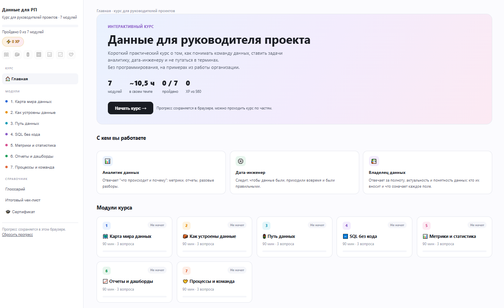
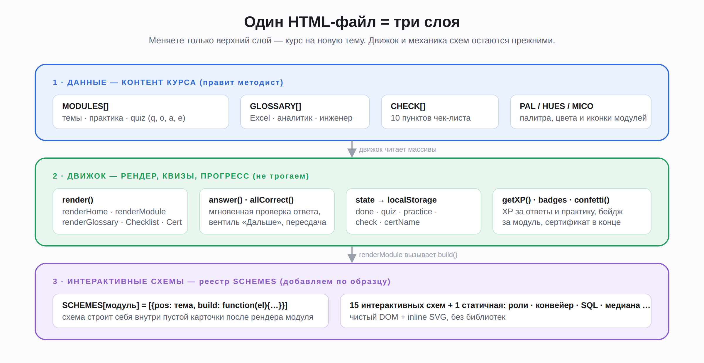

# Данные для руководителя проекта — интерактивный курс в одном HTML-файле

Учебный геймифицированный курс о том, как руководителю проектов работать с командой данных: кому ставить какую задачу, как устроены данные, как читать SQL без кода, как не обманываться цифрами и что такое техдолг данных. Примеры — из реальной организации (заявления, объекты, сроки согласования), но формат легко переделать под любую тему.

**Один файл `index.html` (~115 КБ), без библиотек, сборщиков и бэкенда.** Открывается двойным кликом, работает офлайн, прогресс хранится в браузере.



## Что внутри

| | |
|---|---|
| Модули | 7 × ~90 мин |
| Интерактивные схемы | 15 + 1 статичная (чистый DOM + inline SVG) |
| Вопросы с мгновенной проверкой | 21 |
| Глоссарий «три мира одного понятия» | 28 терминов: Excel / аналитика / инженерия данных |
| Итоговый чек-лист | 10 пунктов |
| Геймификация | XP, бейджи за модули, вентиль «Дальше», сертификат с печатью в PDF |

Модули: карта мира данных (аналитик · дата-инженер · владелец данных) → как устроены данные → путь данных → SQL без кода → метрики и статистика → отчёты и дашборды → процессы и команда.

Геймификация здесь — для вовлечения и запоминания, а не для контроля: централизованной статистики нет, прогресс лежит только в браузере пользователя.

## Быстрый старт

1. Скачайте `index.html` (кнопка **Code → Download ZIP** или прямо файл).
2. Откройте его в любом современном браузере (Chrome, Firefox, Safari, Edge).
3. Всё. Прогресс сохранится в этом браузере; кнопка «Сбросить прогресс» — внизу боковой панели.

Онлайн-демо: **[ссылка на GitHub Pages]**

## Как устроен файл



Три слоя в одном файле:

1. **Данные** — массивы `MODULES`, `GLOSSARY`, `CHECK` в начале `<script>`. Это весь контент курса.
2. **Движок** — рендер страниц, квизы, прогресс в `localStorage`, XP и бейджи. Его менять не нужно.
3. **Интерактивные схемы** — реестр `SCHEMES`: `{pos: номер_темы, build: function(el){…}}`. Движок вставляет пустую карточку после нужной темы и вызывает `build`.

Формат вопроса:

```javascript
{q:'Текст вопроса',
 o:['Вариант 0','Вариант 1','Вариант 2','Вариант 3'],
 a:1,                         // индекс верного варианта
 e:'Пояснение после ответа'}
```

## Как сделать свой курс

**Руками**

1. Откройте `index.html` в текстовом редакторе.
2. Замените содержимое `MODULES`, `GLOSSARY`, `CHECK` (и при желании иконки `MICO`).
3. Поменяйте `KEY` (ключ `localStorage`), название курса в `<title>`, `.brand` и `renderHome`.
4. Нужен свой интерактив — добавьте запись в `SCHEMES` по образцу.
5. Откройте в браузере, проверьте консоль (F12) на ошибки.

Количество модулей интерфейс считает сам из `MODULES.length`.

**Нейросетью** — готовый промпт в [PROMPT.md](PROMPT.md): приложите файл и опишите тему, аудиторию и контекст.

## Развёртывание

- **GitHub Pages:** Settings → Pages → Source: `main`, папка `/ (root)`. Через минуту курс доступен по `https://<логин>.github.io/<репозиторий>/`.
- **Корпоративный сервер / общий диск / wiki:** просто положите файл. Бэкенд не нужен.
- **Android WebView:** файл в `assets/`, `loadUrl("file:///android_asset/index.html")`, включите `domStorageEnabled`.

## Ограничения (сознательные)

Это учебный пример с урезанным функционалом. Чего здесь нет: тёмной темы, аналитики прохождения, SCORM/xAPI. Идеи и pull request'ы приветствуются.

## Статья и полная программа

- Разбор на Хабре: **[ссылка на статью]**
- Полная программа по работе с данными для управленцев: [courserp.ru](https://courserp.ru) все права принадлежат создателю - курса Ольге Шаран, при использовании, обязательно указание авторства.

## Обратная связь

Вопросы, идеи, найденные ошибки — в Issues или на почту [info@courserp.ru](mailto:info@courserp.ru).

## Лицензия

[MIT](LICENSE) — используйте, меняйте, распространяйте, в том числе внутри компании.
